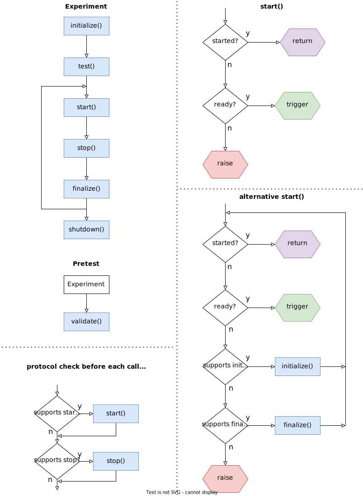

# service usage

# Background
Experiments require control and coordination of DAQs, video cameras, stimulus devices - each with their own specific set of function calls. 
- as a result, scripts for running an experiment become highly "coupled" to the device libraries used.

For example, operating a stimulus device typically requires:
- connecting hardware
- setting up the stimulus
- starting 
- monitoring progress
- stopping
- collecting any files generated

with specific code for each task, executed at specific times in an experiment. 

Switching to a completely different stimulus would require modifying lots of code throughout the experiment script - so much that it might be faster to just start-over with a new script based around the new stimulus.

 By Евгений Мирошниченко, <a href="http://creativecommons.org/publicdomain/zero/1.0/deed.en" title="Creative Commons Zero, Public Domain Dedication">CC0</a>, <a href="https://commons.wikimedia.org/w/index.php?curid=104043458">Link</a>

To move from b) to a), we need to create **a simple, common set of commands for all the devices used**.

This might sound impossible - after all, a  video camera for tracking animal behavior has quite different software to, say, a 2-photon microscope. But with careful planning, the implementation details for each device's specific tasks can be moved out of the experiment script and into cohesive modules which can be used via a minimal set of functions - the "interface" connecting the modules in a).

- guidelines for achieving this, to simply the coordination of complex experiments
- examples written in python, but the concepts can be implemented in any language