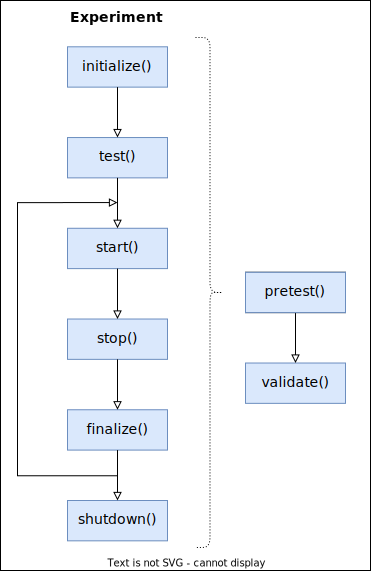

# Bensai
Todo:
- converge on one term: component, device, service
- update diagram and break into parts
- add white background to wikipedia figure
- add cost of failure to motivation

## **Motivation**
Experiments require control and coordination of DAQs, video cameras, stimulus devices - each with their own specific set of function calls. 
- as a result, scripts for running an experiment become highly "coupled" to the device libraries used.

For example, operating a stimulus device typically requires:
- connecting hardware
- setting up the stimulus
- starting 
- monitoring progress
- stopping
- collecting any files generated

with specific code for each task, executed at specific points during an experiment. To switch to a completely different stimulus would likely require modifying code throughout the experiment script - so much that it might be faster to just start-over with a new script based around the new stimulus.

Although swapping out a device might only happen rarely, a high-degree of coupling makes it generally difficult to modify any part of the code without knock-on effects in other parts. Maintainance requires knowledge of the codebase in its entirety. As the experiment becomes more complex (in number of components and tasks), the code becomes more complicated, and we become reluctant to make any changes once it works. The weight of the existing code can completely discourage us from trying new experiments.

<p><a href="https://commons.wikimedia.org/wiki/File:CouplingVsCohesion.svg#/media/File:CouplingVsCohesion.svg"></a><br>Fig. 1: a) The ideal organization separates modules of code according to their responsibilities, and joins them with a clean interface. b) High coupling between modules of code makes it harder to modify, extend, or fix bugs. It also becomes more difficult to understand. <i>Image credit: Евгений Мирошниченко, <a href="http://creativecommons.org/publicdomain/zero/1.0/deed.en" title="Creative Commons Zero, Public Domain Dedication">CC0</a>, <a href="https://commons.wikimedia.org/w/index.php?curid=104043458">Link</a></i></p>

We need to move from scenario b) to a) in Fig. 1, where the code for the component device on the right is isolated from the experiment logic on the left; if necessary the module on the right could be swapped out completely without modifying any code on the left. 

To achieve this, we need to create **a simple, common set of commands for all the components of the experiment**.
The implementation details of each component's tasks should be moved out of the experiment script and into cohesive, self-contained modules, which can be called through a minimal set of functions: the "interface" connecting the two modules shown in Fig. 1a.

## **Aims**
The aim of this document is to provide practical advice and guidelines to help simplify the coordination of complex experiments. 

We've tried to create a framework that's as minimalistic, flexible, and widely-applicable as possible. In our own experiments, it was straightforward to make all of the devices and services we use conform to this framework. It isn't a library of code that you need to learn and start using: more like a series of good practices that we've found to be helpful in keeping code manageable.

Examples are written in Python using object-oriented programming paradigms, but the concepts will transfer to Matlab or other general-purpose languages.

## **Nomenclature**

- *experiment script* - the top-level piece of code that the experimenter interacts with, which coordinates all aspects of the experiment.

- *function* - a unit of code that carries out some work.

- *object* - a unit of code which contains data, and functions that use that data.

- *class* - a unit of code that defines the data and functions than an object contains, like a set of instructions.
Objects are said to be *instances* of a particular class.

## **Verbs/Commands == Tasks == Functions/Methods**
Within our main experiment script, we issue commands to setup devices, start recordings, start stimuli, then later wrap up and take care of data that were generated. These commands are the verbs in the grammar of our exeperiment workflow: prepare, start, stop, finalize. Each is instructing a component to carry out some task.

We wish to create a common set of commands, or interface, for all of the components of the experiment, but do so the commands must necessarily be quite vague. The precise details of starting a DAQ may be quite different to starting a video camera - but at the level of our experiment script we only need to know that both are started at the correct times. 

We therefore also need to have a pre-defined sequence in which the commands will be executed.

The following core commands comprise the life-cycle of a component in an experiment. 

- each command will be implemented as a function that commands the component to carry out any necessary tasks. 

- each function will only be called after the preceding ones have finished. 

- not all functions necessarily need to be implemented for every component, but the functions that are implemented will be called in a consistent order. 




Fig. 2: Command functions for a component or device. **Left:** Core commands are executed with a fixed order. Experiments with multiple trials might loop over inner commands. **Right:** The `pretest()` command should execute all of the commands used in the experiment.

`initialize()` 
> *Run all setup and configuration to effectively reset the component for fresh use.*

- connect hardware
- start associated computers, software
- set parameters specific to experiment
- clear previously-collected data

***

`test()`
> *Confirm that the component is ready for use and any necessary conditions are met - otherwise raise an error.*

- verify connections, ping hosts
- check available disk space
- check write permissions on filesystem
- verify device is not busy/started

***

`start()`
>*Trigger the component's primary effect.*

- start data acquisition 
- start stimulus presentation
- start video recording
- take a single snapshot

It's desirable to be able to check whether `start()` has already been called on the component. If this information can't be obtained from the device, a flag should be set when `start()` runs. Then, if `start()` is called twice by accident, you can decide whether to stop and restart, raise an error, or do nothing. 

***

`verify()`
> *Assert that the component has started successfully - otherwise raise an error.*

- stimulus is presenting correctly
- data files are increasing in size on disk
 
***

`stop()`
> *Stop the previously-started component.*

- cease acquisition, presentation, etc.
- not implemented for a single snapshot 

***

`finalize()`
> *Handle the result of the most-recent use. Should leave the component ready for additional use.*

- await processing, conversion
- move, rename, backup data

After `finalize()`, the component should be ready for re-use by looping back to `start()` or `initialize()`.

***

`shutdown()`
> *Close the component gracefully.*

- close connections
- close associated software, computers
- switch off power, lights, etc.


### **Functions with zero input arguments**
***
The most important feature of the functions described above is that they should have **no input arguments in their signature**. 

We'll discuss how to achieve this in the next section on modules and classes.

Enforcing this constraint will allow us to command any component of our experiment in the exact same way from our main experiment script.

As an example, let's say we have 5 components in our  experiment:

```python
components = (CameraA, CameraB, DAQ, EphysRec, VisualStim)
```

The initial setup of these components in our experiment script then becomes as simple as:

```python
for component in components:
    component.initialize()
    component.test()
```

There are no details about *how* each component is initialized or tested: we trust that the specifc code for those tasks is handled correctly elsewhere. 

Here, we only care about *what* happens and *when*. 

If `initialize()` or `test()` required input arguments, we'd need to supply them in the setup loop above. The specifics of each component would need to be known, and the loop becomes more complicated. The details of *how* the tasks happen start to creep into our experiment script...


### **Extra**
***
These additional commands have also proved necessary for most components but, unlike the "core" commands above, don't strictly need to be executed at specific times in the experiment workflow. They can be thought of as a separate, pre-experiment workflow:

`pretest()`
> *Comprehensively test component functionality by running all other functions.*

- simulate usage in an actual experiment
- generate representative data

Typically, `pretest()` would be run any time changes are made to hardware or software, and before each experiment.

***

`validate()`
> *Assert that the most-recently collected data are as expected.*

- check size of data
- check files can be opened
- check contents  


### **Rejected commands**
***
The following functions were trialled, then later removed for the reasons summarized here:

`prime()` 
> *Prime the component for imminent start.*

This was only rarely useful. If priming a device is necessary, it can be handled within `initialize()` or `start()`

***

`configure()`

> *Get and apply configuration to device.*

Configuration is one of the responsbilities of `initialize()` and doesn't require it's own command. We might also be tempted to supply a set of configuration parameters as an input argument to `configure()` - something we're aiming to avoid.


## **Nouns == Devices == Modules or Classes**
***
With the interface of zero-argument commands defined for a hypothetical component, we now need to organize the code that actually implements these commands. 

In the previous example, we introduced a sequence of components:

```python
components = (CameraA, CameraB, DAQ, EphysRec, VisualStim)
```

Each component is a noun: a thing which possesses functions such as `initialize()`, `start()`, `stop()`.

In object-oriented programming, these nouns are implemented as *classes*, from which *objects* are created - which contain data and functions
(*data* in the computing sense: numbers, text, filepaths, booleans... not necessarily the experimental data we're collecting, just information that the object can use to do its job).

Here's a 


- knowing whether a component has a particular command
### Multi-use devices -> multiple nouns
Video camera plus snapshot camera, make two separate classes
## Tips
- configuration (directly modify fields)
- tracking files
- stop on failure
- logging
- timestamps
